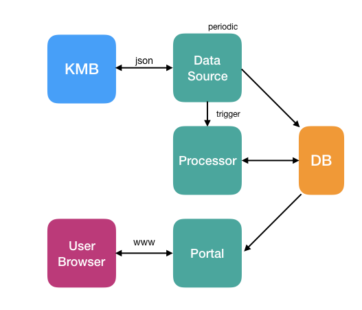

# System Overview
The platform consists of four components:
- Database
- Data Source
- Processor
- Portal

### Database
The database consists of two main tables: data source raw data, and generic processed data. 

### Data Source
The module fetch raw data from KMB(or other origin) and store on internal database. Every data source might have different method to extract data from a particular source, and consolidate the data into an generic database schema.

### Processor
The module process the raw data stored on database and perform data processing like location estimation. The processed results, which are generic, are stored to database. Processor is depends on data source and thus every different origin require a different, yet similar, processor.

### Portal
The portal display a map to user and let user do filtering.

# Components
### Database
We use MySQL here, while maintain compatibility with PgSQL and Oracle.
The database consists of two main tables:
KMB raw data, that is, the data we fetch without any processing. If we support other origin we shall add a table for that.
Generic data used for portal to display bus location. This schema should be independent of data source. 

### Data Source
The data source module is a batch program and run periodically. It fetch data from origin with origin-specific method, for instant, KMB returns data in json over multiple end-points. The program store the raw data into database and notify processor.

### Processor
The processor will do the estimation using raw data. For instant, KMB provide arrival time but no bus location, we will need to invent a formula to estimate location based on such data.

### Portal
The portal should be a static page hosted on nginx and do client-side (javascript) ajax update on the bus locations. In the proof of concept we return a full list of locations per ajax call, while in future we might optimize and give a diff instead.

# Scaling & Redundancy
### Database
Database should use standard scaling and redundancy technique.

### Data Source
As there are many bus routes and each raw data query about a route is independent, we can make multiple instance of Data Source each responsible to fetch data from a particular set of routes. We may also design a controller to dispatch/assign works dynamically.
Data Source redundancy can be implemented with heartbeat and cold restart or stand-by.

### Processor
We expect Data Processing should be relative fast and thus there is no requirement on multiple processor, but by design the processor should not care how many instance exists on the platform. 
Processor redundancy can be implemented with heartbeat and cold restart or stand-by.

### Portal
The portal should use standard web scaling and redundancy techniques.